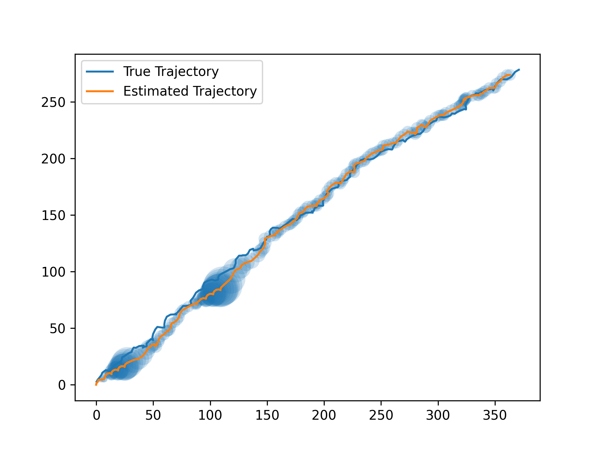
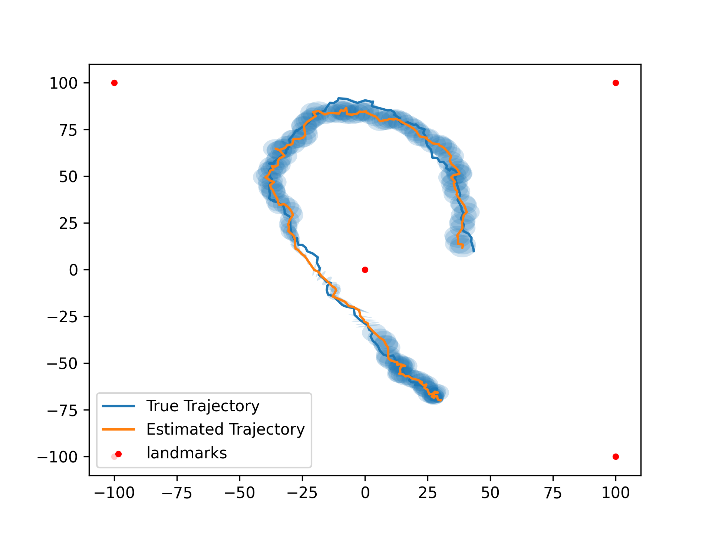
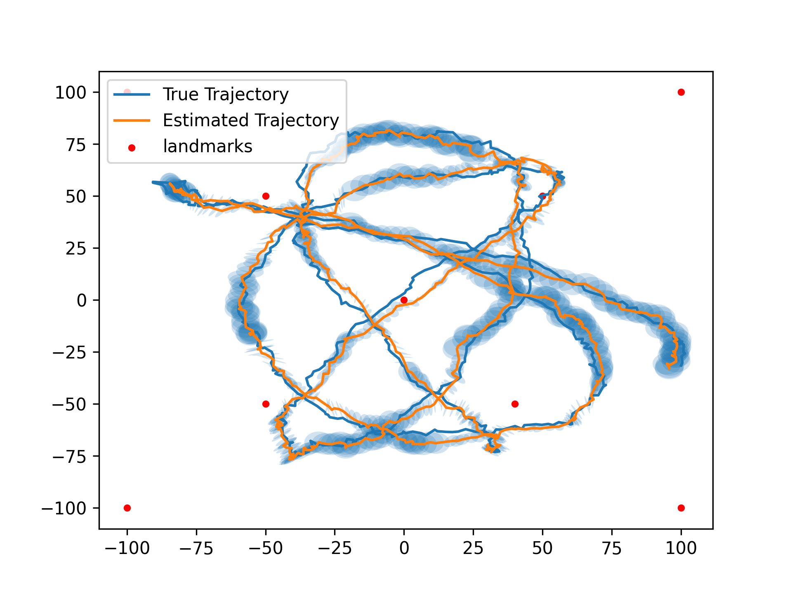
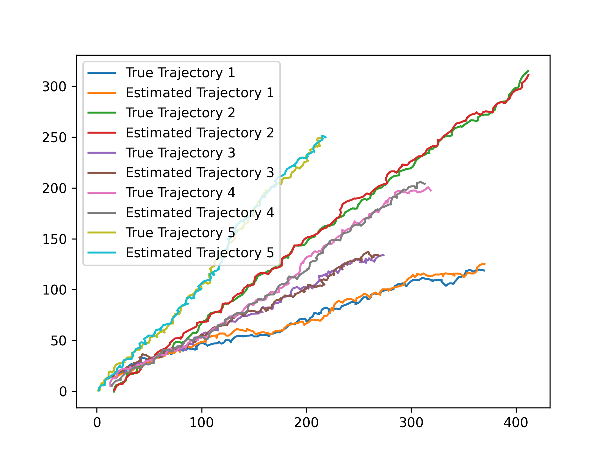

# Kalman Filtering

The detailed problem statement can be found [here](./problem_statement.pdf) while the report can be found [here](./report.pdf).

## Linear models

With linear sensor models, the mean and standard deviation (uncertainty) are plotted. If the sensor measurements drop in the middle, then the uncertainty increases, but the model is still able to estimate the state. 

     

## Non-Linear models

When landmarks are added such that the distance from the landmark (within a radius) is an additional observation, the uncertainty reduces around the landmark. By its nature, the observation model becomes non-linear, and so the extended kalman filter is to be used. 

     
     

## Data Association

The data association problem happens when there are multiple observations from different sources coming together. The observation needs to matched (associated) to be able to track accurately.

     

